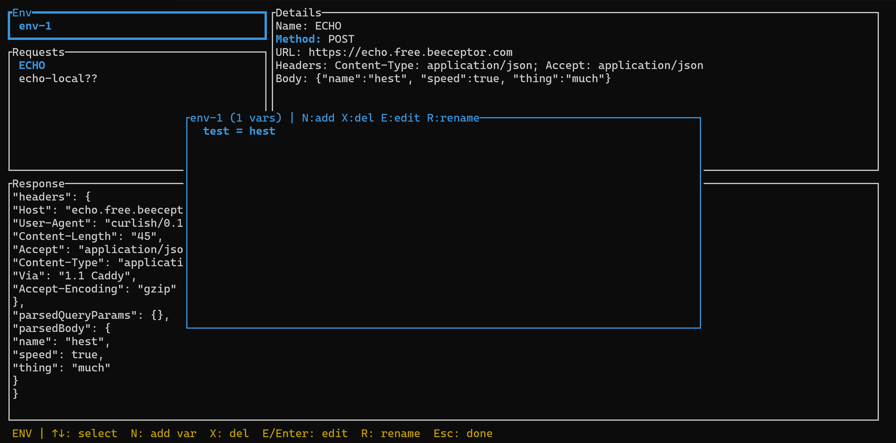

# curlish

A lightweight TUI for saving and running HTTP requests, sitting between curl and Postman.



## Features
- List, create, duplicate, edit, delete and execute HTTP requests
- JSON storage in `.curlish.json` (portable, human-readable)
- Keyboard-first navigation (WASD for areas, arrow keys within)
- Environments with `${variable}` placeholder substitution in URL, headers and body
- Header name/value autocomplete for common HTTP headers
- Inline body editor with `Ctrl+P` to prettify JSON
- Warns on quit with unsaved changes
- Optional git-based sync for sharing requests across machines

## Keys

### Normal mode
| Key | Action |
|---|---|
| `W/A/S/D` | Navigate between areas (Env, Requests, Details, Response) |
| `↑/↓` | Navigate within the focused area |
| `E` | Edit field (Details) or edit environment variables (Env) |
| `R` | Run request |
| `N` | New request / new environment (context-dependent) |
| `C` | Copy (duplicate) selected request |
| `X` | Delete request / environment (context-dependent) |
| `Ctrl+S` | Save to disk |
| `G` | Sync (pull + push via git) |
| `Shift+G` | Configure sync (enter repo URL, empty to disable) |
| `Q` | Quit (confirms if unsaved changes) |

### Edit modes
| Context | Keys |
|---|---|
| Inline edit (Name, URL) | Type freely, `Enter` to confirm, `Esc` to cancel |
| Method picker | Type to filter, `↑/↓` to select, `Enter` to confirm |
| Header list | `N` add, `X` delete, `E`/`Enter` edit, `Esc` done |
| Header edit | `Tab`/`↑/`↓` for autocomplete, `Enter` to advance, `Esc` to cancel |
| Body editor | Type freely, `Ctrl+P` prettify JSON, `Esc`/`Ctrl+S` save & exit |
| Env editor | `N` add var, `X` delete, `E`/`Enter` edit, `R` rename env, `Esc` done |

## Environments
Create environments to store key-value variables. Use `${key}` placeholders
in URLs, header values and request bodies — they are resolved at execution time
using the active environment.

## Storage
Requests and environments are saved to `.curlish.json` in the working directory.

## Sync
Optionally back the JSON file with a git repo for sharing across machines.

1. Press `Shift+G` and enter a git repo URL to enable
2. Press `G` to manually sync (save → commit → push)
3. `Ctrl+S` auto-pushes when sync is configured
4. On conflict, choose **Keep local** (force push) or **Take remote** (force pull)

Config is stored in `.curlish-sync.toml`. Clear the URL to disable.

## Run
```sh
cargo run
```

## Test
```sh
cargo test
```
